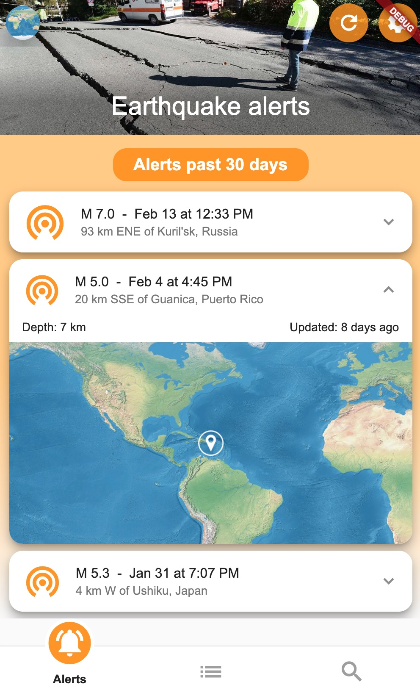
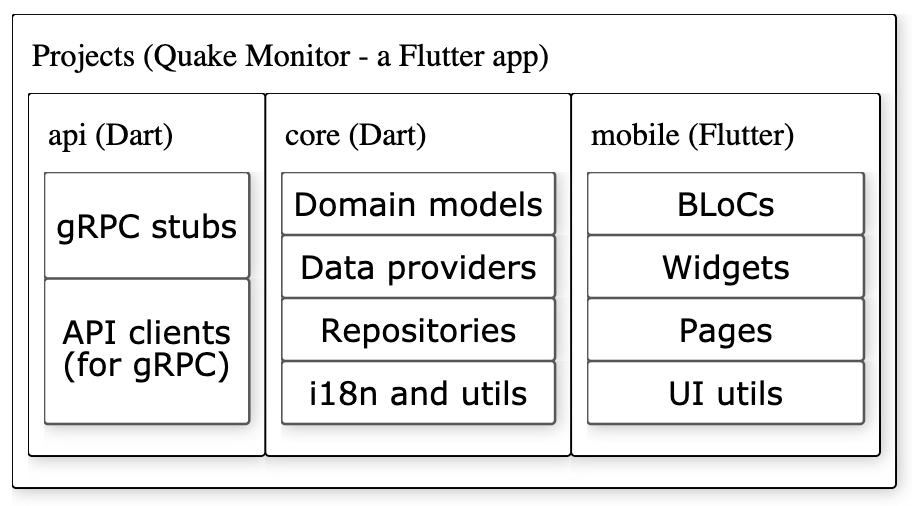

# Quake Monitor - Flutter app to monitor earthquakes

This is an experimental sample app based on 
[Flutter](https://flutter.dev/)
and [Dart](https://dart.dev/).

The purpose is to learn Dart and Flutter, to experiment with Flutter's 
[support for the web platform](https://flutter.dev/web) and to test different API-technologies for 
implementing communication between a mobile (or web) app and backend services.

This app has backend service integrations based on either 
[RESTful APIs](https://en.wikipedia.org/wiki/Representational_state_transfer)
or [gRPC](https://grpc.io/) services.

For example the related repository 
[quake](https://github.com/navibyte/quake) implements a gRPC service 
providing earthquake data.

## Screenshot

Quake Monitor sample app running on Chrome based on the [Flutter web](https://flutter.dev/web) platform. Locally tested also on iOS simulator.

## Projects

This repository contains three separate Dart or Flutter projects with
each having their own `pubspec.yaml` dependency file. 

Please open
each project separately on an IDE. Each project has also own README
describing the code and dependencies for a project.

Project | SDK | Description 
------- | --- | -----------
[api](api) | Dart & gRPC | API client and generated stub for gRPC service providing earthquake data.
[core](core) | Dart | Platform independent domain models, data providers (API clients), repositories, i18 and other shared utilities.
[mobile](mobile) | Flutter | Blocs (state management), widgets, pages and UI related utilities.

## Dependencies

See code projects introduced above for Dart and Flutter libraries linked.

## Authors

This project is authored by **[Navibyte](https://navibyte.com)**.

## License

This project is licensed under the MIT License - see the [LICENSE](LICENSE).

## Links

The app is based on SDKs:
* [Dart](https://dart.dev/)
* [Flutter](https://flutter.dev/)
* [gRPC](https://grpc.io/)

Other key libraries used by the app: 
* [Bloc](https://bloclibrary.dev/)
* [Equatable](https://pub.dev/packages/equatable)
* [Circular Bottom Navigation](https://pub.dev/packages/circular_bottom_navigation)

Data sources: 
* earthquakes from the [GeoJSON service](https://earthquake.usgs.gov/earthquakes/feed/v1.0/geojson.php) of the USGS
* place searches from the [GeoNames.org](https://www.geonames.org/) service

Other assets:
* App bar images by [Marcello Migliosi](https://pixabay.com/users/marcellomigliosi1956-1650894/?utm_source=link-attribution&utm_medium=referral&utm_campaign=image&utm_content=1790896) via [Pixabay](https://pixabay.com/)

Inspiration for how to handle state using the
[Bloc](https://bloclibrary.dev/) library
and how to structure model, repository,
bloc and widget layers originates from
[Flutter Weather Tutorial](https://bloclibrary.dev/#/flutterweathertutorial) 
by [Felix Angelov](https://twitter.com/felangelov) 
(see also related example [repository](https://github.com/felangel/bloc/tree/master/examples/flutter_weather)).

Inspiration for the sub-project structure originates from 
[inKino](https://github.com/roughike/inKino) app by 
[Iiro Krankka](https://twitter.com/koorankka).

